# 🕵️‍♂️ Observability Without Oversharing: Privacy-Conscious Telemetry for LLMs

Welcome to the hands-on workshop delivered at **AI_dev EU 2025** in Amsterdam! This repository contains everything you need to follow along.

- **Talk Page**: [https://sched.co/25TuD](https://sched.co/25TuD)

In this 1-hour workshop, you'll learn how to achieve robust observability for Large Language Models (LLMs) while safeguarding sensitive data. As LLMs become integral to production systems, monitoring their performance, usage, and costs is essential—but so is protecting user privacy! This session addresses these challenges using a powerful stack of open-source tools.

Join us to gain practical skills in ethical AI monitoring and contribute to the future of responsible AI observability!

## 🎓 Workshop Labs
This repository includes a comprehensive hands-on workshop series:

**📖 [Complete Workshop Guide](labs/README.md)**

### Lab Series:
1. **[Lab 1: Baseline Setup](labs/LAB_01_BASELINE.md)** (10 min) - Set up LLM application without observability
2. **[Lab 2: Basic Observability](labs/LAB_02_BASIC_OBSERVABILITY.md)** (15 min) - Add OpenLIT & OpenTelemetry  
3. **[Lab 3: Full Observability Stack](labs/LAB_03_FULL_OBSERVABILITY.md)** (15 min) - Complete with Grafana, Prometheus, Tempo
4. **[Lab 4: Privacy-Conscious Observability](labs/LAB_04_PRIVACY_OBSERVABILITY.md)** (10 min) - Implement PII masking

## ✨ What You'll Use

This project provides a complete environment to explore privacy-conscious LLM observability:

- **🤖 LLM Backend**: Switch between `Ollama` (local) or `Azure OpenAI` (cloud)
- **💬 Chat Interface**: A session-based chat CLI with rolling history
- **📈 Observability Stack**:
  - **OpenLIT**: Specialized LLM observability with automatic instrumentation
  - **Prometheus**: For metrics storage and alerting
  - **Grafana Tempo**: For distributed trace storage and retrieval
  - **Grafana**: Pre-configured dashboards for LLM-specific metrics
- **🐳 Containerized Services**: The entire stack runs in Docker, managed with Docker Compose
- **Simplified Workflow**: A `Makefile` provides simple commands for all common actions

---

## System Requirements

### For GitHub Codespaces (Recommended)
- GitHub account with Codespaces access
- Modern web browser
- **No local setup required** - everything runs in the cloud!

### For Local Development
- **Docker Desktop** with at least:
  - 8GB RAM allocated to Docker
  - 10GB free disk space
  - Docker Compose v2.0+
- **Git** for repository management
- **Make** utility (included on Linux/macOS, install via tools on Windows)
- **VS Code** with Dev Containers extension (optional but recommended)

### LLM Provider Requirements
Choose **one** of the following:
- **Ollama (Local)**: Automatically available in Codespaces, or [install locally](https://ollama.ai/)
- **Azure OpenAI**: Valid API key and endpoint from Azure portal

---

## 🚀 Quick Start (GitHub Codespaces)

The easiest way to get started is with GitHub Codespaces, which provides a pre-configured cloud-based development environment.

1.  **Create a Codespace**:
    - Open this repository on GitHub.
    - Click the green **< > Code** button.
    - Go to the **Codespaces** tab and click **Create codespace on main**.

2.  **Wait for Initialization**: The dev container will set up Docker and all necessary tools automatically.

3.  **Create Your Environment File**:
    ```bash
    cp .env.example .env
    ```

4.  **Build and Start the Stack**:
    ```bash
    make docker-up
    ```

5.  **Chat with the LLM**:
    ```bash
    make docker-cli
    ```

> **Note for Codespaces Users**: Ollama is pre-installed and running at `http://localhost:11434`. The containers are automatically configured to access it, so no extra setup is needed!

---

## 💻 Alternative: Local Dev Container

If you prefer to run this project locally, you can use VS Code Dev Containers. The initial setup may take longer as it builds the required Docker images on your machine.

**Requirements**:
- Visual Studio Code
- Docker Desktop
- The [Dev Containers extension](https://marketplace.visualstudio.com/items?itemName=ms-vscode-remote.remote-containers) for VS Code.

**Steps**:
1. Clone this repository and open the folder in VS Code.
2. When prompted, click **Reopen in Container**. (Or, open the Command Palette and select `Dev Containers: Reopen in Container`).
3. In the dev container's terminal, set up your environment and start the stack:
   ```bash
   cp .env.example .env
   make docker-up
   make docker-cli
   ```

> **Note for Local Dev Users**: Ensure Ollama is running on your host machine (e.g., by running `ollama serve`). The default `.env` configuration should work out-of-the-box.

---

## ▶️ How to Use the Stack

### Start All Services

This command builds the Docker images (if they don't exist) and starts all services in the background.

```bash
make docker-up
```

Once running, you can access the following services (Codespaces will prompt you to forward the ports):

- **API Docs**: [http://localhost:8000/docs](http://localhost:8000/docs) - Interactive API documentation
- **API Health Check**: [http://localhost:8000/healthz](http://localhost:8000/healthz) - Provider and model status
- **Grafana Dashboard**: [http://localhost:3000](http://localhost:3000) - LLM observability metrics (Anonymous admin enabled)
- **Prometheus**: [http://localhost:9090](http://localhost:9090) - Raw metrics and queries
- **Tempo**: [http://localhost:3200](http://localhost:3200) - Trace storage (accessed via Grafana)

### Use the Terminal CLI

After the stack is running, open the interactive chat CLI:

```bash
make docker-cli
```

This command will either attach to an existing CLI container or create a new one. Type your messages to chat with the model, and press `Ctrl+C` to exit.

---

## ⚙️ Configuration

You can customize the application by editing the `.env` file.

### LLM Provider

Choose between `ollama` (default) and `azure`.

```env
# LLM Provider Selection (ollama | azure)
LLM_PROVIDER=ollama

# --- Ollama Settings ---
OLLAMA_MODEL=phi4-mini
OLLAMA_BASE_URL=http://localhost:11434
```

### Privacy Configuration

Control PII detection and masking behavior:

```env
# Enable/disable PII masking (default: true)
PII_MASKING_ENABLED=true
```

When enabled, the system automatically detects and masks:
- **US SSN/ITIN**: `333-32-4555` → `333-32-****`
- **Email Addresses**: `user@domain.com` → `{{EMAIL}}`
- **Phone Numbers**: `(555) 123-4567` → `{{PHONE}}`
- **Names**: `John Doe` → `{{NAME}}`
- **IP Addresses**: `192.168.1.1` → `{{IP}}`
- **IBANs**: `DE89370400440532013000` → `{{IBAN}}`

### Optional: Azure OpenAI

If you want to use Azure, update your `.env` file with the following settings:

```env
LLM_PROVIDER=azure

# --- Azure OpenAI Settings ---
AZURE_OPENAI_ENDPOINT=https://your-resource.openai.azure.com/
AZURE_OPENAI_API_KEY=your-api-key
AZURE_OPENAI_MODEL=gpt-4.1-mini
# AZURE_OPENAI_API_VERSION=2024-02-15-preview  # (Default)
```

---

## 🔍 Project Details

```mermaid
graph TD
    U[👤 User] --> CLI[📱 CLI Client]
    CLI --> API[🚀 FastAPI App]
    
    API --> PII[🔒 Presidio PII Masker]
    PII --> LLM[🤖 LLM Provider]
    
    LLM --> OLLAMA[🦙 Ollama Local]
    LLM --> AZURE[☁️ Azure OpenAI]
    
    API --> OPENLIT[📊 OpenLIT]
    OPENLIT --> OTEL[📡 OTel Collector]
    
    OTEL --> TEMPO[📦 Tempo]
    OTEL --> PROM[📈 Prometheus]
    
    TEMPO --> GRAFANA[📊 Grafana]
    PROM --> GRAFANA
```

<details>
<summary><strong>🏗️ Architecture Overview</strong></summary>



**Privacy Flow:**
1. User input → Presidio PII masker
2. Sanitized text → LLM processing  
3. Only masked data in telemetry traces

</details>

<details>
<summary><strong>📂 Project Structure</strong></summary>

```
apps/
├── api/                    # FastAPI application with PII masking
│   ├── main.py            # App initialization & lifespan
│   ├── routers/inference.py # Chat endpoint with PII protection
│   ├── services/llm_client.py # Unified LLM client (Ollama/Azure)
│   └── utils/pii_masker.py # Presidio PII detection & masking
├── cli/                    # Interactive terminal chat client
├── otel_col/              # OpenTelemetry Collector configuration
├── grafana/               # Grafana dashboards & provisioning
├── grafana_tempo/         # Tempo trace storage configuration
└── prometheus/            # Prometheus metrics configuration
```

</details>

<details>
<summary><strong>📊 Observability Stack</strong></summary>

- **OpenLIT** → LLM-specific observability with automatic instrumentation
- **OpenTelemetry Collector** → Routes traces to Tempo, metrics to Prometheus  
- **Grafana Tempo** → Distributed tracing storage and querying
- **Prometheus** → Time-series metrics storage
- **Grafana** → Visualization dashboards for metrics and traces

</details>

<details>
<summary><strong>🔒 Privacy Implementation</strong></summary>

**PII Detection Pipeline:**
```python
# Before LLM processing in apps/api/routers/inference.py
user_message = PIIMasker.get_instance().mask(request.user_message)
```

**Supported Entity Types:**
- Financial: US_SSN, US_ITIN, CREDIT_CARD, IBAN_CODE
- Personal: PERSON, EMAIL_ADDRESS, PHONE_NUMBER  
- Infrastructure: IP_ADDRESS, US_DRIVER_LICENSE, US_PASSPORT

**Masking Strategies:**
- Partial masking: `333-32-4555` → `333-32-****`
- Token replacement: `user@domain.com` → `{{EMAIL}}`

</details>

<details>
<summary><strong>📜 Makefile Commands</strong></summary>

- `make help` — List all available commands
- `make docker-up` — Build and start the entire stack
- `make docker-cli` — Open interactive chat CLI
- `make docker-logs` — Tail logs from all services
- `make docker-ps` — List running services
- `make docker-down` — Stop and remove services
- `make docker-reset` — Complete reset (including volumes)
- `make test-api` — Smoke-test the chat endpoint

</details>

<details>
<summary><strong>🌐 API Endpoints</strong></summary>

- `GET /` — Root info and available endpoints
- `GET /healthz` — Health status (provider, model, PII masking)
- `POST /v1/chat` — Main chat endpoint with PII protection
- `GET /docs` — Interactive API documentation (Swagger UI)

</details>


---

## 🛠️ Troubleshooting

- **Health Check Degraded**: Check your `.env` provider settings and ensure the chosen backend (Ollama or Azure) is reachable. Restart the stack with `make docker-down && make docker-up`.
- **Ollama in Codespaces**: The first chat may be slow if the model (`phi4-mini`) needs to be downloaded.
- **Ports Not Opening**: If ports 8000 (API) or 3000 (Grafana) aren't forwarded in Codespaces, open them manually from the **Ports** tab.
- **Stuck Containers**: If something seems wrong, run `make docker-reset` to completely reset the environment.
- **Docker Build Issues**: If services fail to build, try `make docker-rebuild-nocache` to force a clean rebuild.

- **Provider Connection Failed**: Verify your Azure API keys or Ollama service status using the health check endpoint.

## 📚 Glossary

**OpenTelemetry (OTEL)**: An open-source observability framework for collecting, processing, and exporting telemetry data (traces, metrics, logs).

**OpenLIT**: An open-source LLM observability tool that provides automatic instrumentation for LLM applications using OpenTelemetry.

**OTLP**: OpenTelemetry Protocol - the standardized protocol for transmitting telemetry data between applications and observability backends.

**Traces**: Detailed records of individual requests as they flow through distributed systems, showing timing and dependencies.

**Metrics**: Numerical measurements that provide insights into system performance, resource usage, and business KPIs over time.

**Grafana**: Open-source visualization and analytics platform for monitoring and observability dashboards.

**Prometheus**: Open-source time-series database and monitoring system, commonly used for storing metrics data.

**Tempo**: Grafana's open-source distributed tracing backend for storing and querying trace data.

**PII (Personally Identifiable Information)**: Any data that can be used to identify a specific individual, requiring special handling for privacy compliance.

**Presidio**: Microsoft's open-source data protection toolkit for detecting and anonymizing PII in text and structured data.

---

## 📄 License

This project is licensed under the terms of the [LICENSE](LICENSE) file.
