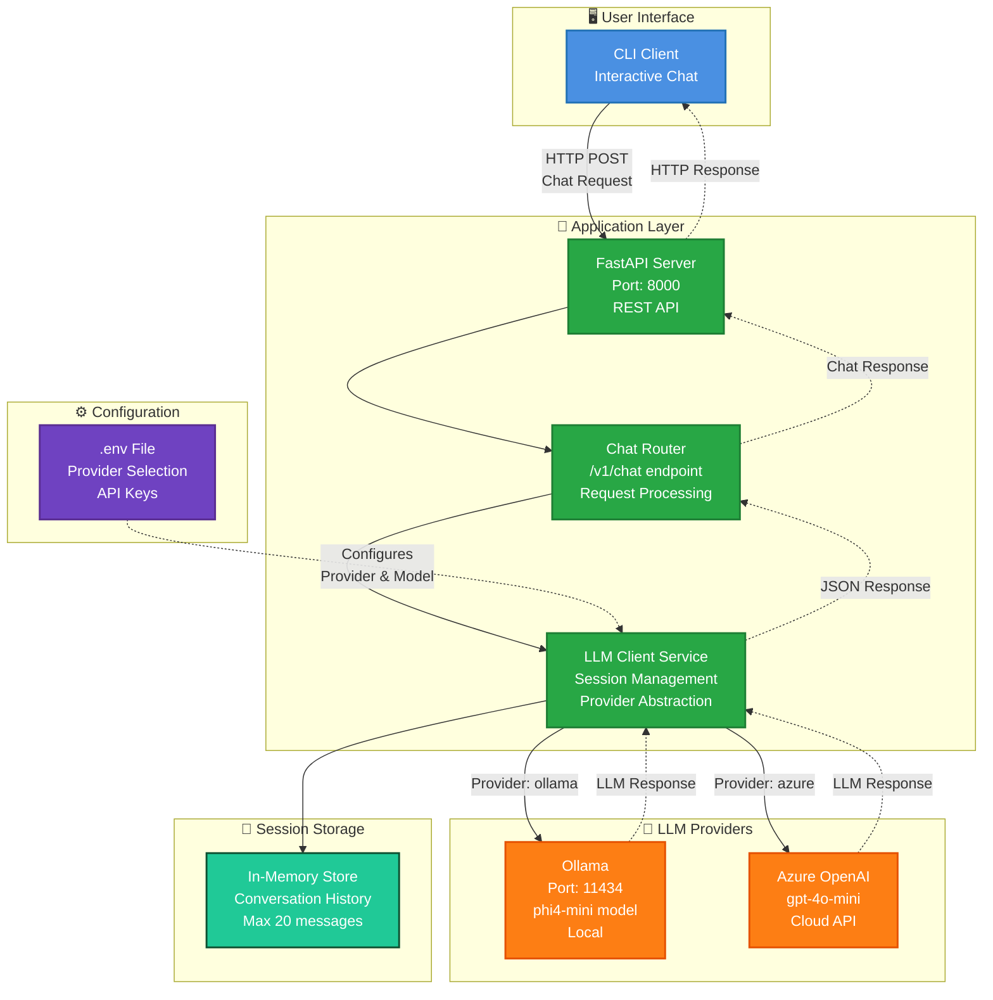

# Lab 1: Baseline Setup 🏗️
**Duration**: 10 minutes  

## 🎯 Objective
Set up and run a basic LLM chat application without observability. This establishes our baseline and helps you understand the core application architecture before adding telemetry.

## 🏗️ Architecture Overview


**🔍 What This Shows:**
- **🖥️ Clean Architecture**: Simple request flow from CLI client through FastAPI to LLM providers
- **🤖 Provider Abstraction**: Single client interface supports both Ollama (local) and Azure OpenAI (cloud)
- **💾 Session Management**: In-memory conversation storage with automatic history management
- **⚙️ Configuration-Driven**: Environment variables control provider selection and settings
- **🚀 RESTful Design**: Standard HTTP API with clear request/response flow
- **❌ No Observability**: Zero visibility into performance, costs, errors, or usage patterns

**🔄 Request Flow:**
1. User interacts with CLI client
2. CLI sends HTTP POST to FastAPI server (port 8000)
3. Chat router processes `/v1/chat` endpoint
4. LLM client service manages session and calls configured provider
5. Provider (Ollama/Azure) generates response
6. Response flows back through the same chain to user

## 🎓 What You'll Learn
- LLM application fundamentals and architecture
- FastAPI backend structure and API endpoints
- Docker Compose service orchestration
- LLM provider configuration (Ollama vs Azure OpenAI)

## 📋 Prerequisites
- Completed workshop setup (GitHub Codespaces or local Dev Container)
- Basic understanding of Docker and APIs

## 🧪 Lab Steps

### Step 1: Switch to Lab 1 (Baseline)
First, we'll switch to the baseline configuration using our lab management system.

🛑 **CRITICAL FIRST STEP**: You **MUST** run this command before proceeding! Skipping this will cause the entire lab to fail because observability components from previous labs will conflict with the baseline setup.

```bash
# Copy environment configuration
cp .env.example .env

# Switch to Lab 1 baseline configuration
make lab1
```

This command will:
- Remove all observability components (OpenLIT, OTEL Collector, Grafana, etc.)
- Reset API code to baseline (no instrumentation)
- Update dependencies to minimal set
- Configure Docker Compose for basic services only

**🔍 Verify the Switch:**
```bash
# Check current lab status
make status
```

You should see:
```
📊 Current lab configuration:
   OpenLIT: ❌ Disabled
   PII Masking: ❌ Disabled
   Observability Stack: ❌ None
```


### Step 2: Examine the Clean Architecture

Let's explore what remains after the reset:

```bash
# Check the current Docker Compose
code docker-compose.yml
```

**🔍 Analysis Questions:**
1. How many services are now defined?
2. What ports are exposed by each service?
3. Which service depends on which?

```bash
# Examine the API structure
tree apps/api/
```

**Key Components:**
- `main.py` - FastAPI application setup and lifespan management
- `routers/inference.py` - Chat endpoint implementation
- `services/llm_client.py` - Unified LLM provider client
- `schemas/` - Request/response models
- `utils/env.py` - Configuration management

### Step 3: Configure Your LLM Provider

You can choose between Ollama (local) or Azure OpenAI (cloud).

> 💡 **Note**: Other providers (Anthropic, Google, etc.) are possible but require SDK modifications beyond this lab's scope.

#### Option A: Ollama (Recommended for Workshop)
```bash
# Copy the example environment file
cp .env.example .env

# The default configuration uses Ollama
cat .env | grep -E "(LLM_PROVIDER|OLLAMA)"
```

**Configuration:**
```env
LLM_PROVIDER=ollama
OLLAMA_MODEL=phi4-mini
OLLAMA_BASE_URL=http://localhost:11434
```

#### Option B: Azure OpenAI (If You Have Access)
```bash
# Edit the .env file
code .env

# Update these values:
AZURE_OPENAI_MODEL=gpt-4.1-mini
AZURE_OPENAI_ENDPOINT=https://your-resource.openai.azure.com/
AZURE_OPENAI_API_KEY=your-api-key
```

### Step 4: Build and Start the Services

```bash
# Build and start the API and CLI services
make docker-up
```

**🔍 Watch the Logs:**
```bash
# In a separate terminal, monitor the startup
make docker-logs
```

You should see:
- API service starting on port 8000
- LLM client initialization
- Provider connection success/failure

### Step 5: Test the Application

#### Health Check
```bash
# Check API health
curl http://localhost:8000/healthz
```

**Expected Response:**
```json
{
  "status": "healthy",
  "provider": "ollama",
  "model": "phi4-mini",
  "details": null
}
```

#### Interactive Chat
```bash
# Start the CLI chat interface
make docker-cli
```

**Try These Interactions:**
1. Simple greeting: "Hello, how are you?"
2. Technical question: "Why is Observability important?"
3. Exit with `Ctrl+C`

#### API Documentation
**In Codespaces:** VS Code will automatically forward port 8000. Look for the "Ports" tab at the bottom and click the globe icon next to port 8000, then add `/docs` to the URL.

**Local setup:** Open your browser to: http://localhost:8000/docs

**🔍 Explore:**
- Available endpoints
- Request/response schemas
- Try the interactive API test


## ❌ Troubleshooting

### Issue: Ollama Connection Failed
```bash
# Check if Ollama is running (in Codespaces, it should be)
curl http://localhost:11434/api/version
```

**Solution**: In Codespaces, Ollama is pre-installed. For local environments, install Ollama or use Azure OpenAI.

### Issue: Port Already in Use
```bash
# Check what's using the port
sudo lsof -i :8000

# Stop any existing containers
make docker-reset
```

### Issue: Health Check Shows Degraded
Check the logs for specific error messages:
```bash
make docker-logs | grep -i error
```

## 🎯 Success Criteria
- [ ] Lab 1 switch completed successfully (`make lab1`)
- [ ] Status shows baseline configuration (`make status`)
- [ ] Application builds and starts without errors
- [ ] Health check returns "healthy" status with correct provider/model
- [ ] CLI chat responds to questions appropriately
- [ ] API documentation accessible via port forwarding (Codespaces) or localhost
- [ ] You understand the baseline architecture without observability

## 📚 Key Takeaways
1. **Baseline Established**: Clean LLM application without any observability instrumentation
2. **Provider Flexibility**: Unified interface supports both Ollama and Azure OpenAI
3. **Session-Based Chat**: Conversations maintain context across interactions
4. **Zero Visibility**: No insight into performance, costs, errors, or usage patterns
5. **Foundation Ready**: Architecture prepared for observability instrumentation

## 🚀 Next Steps
You now have a functional LLM application, but it's running "blind"! We have no visibility into:
- Request volumes and patterns
- Response latency and performance
- Token consumption and costs
- Error rates and failure modes
- User interaction patterns

In **Lab 2**, we'll add basic observability with OpenLIT and OpenTelemetry to start gathering this crucial operational data.

---

**Ready for observability?** → [Lab 2: Basic Observability](LAB_02_BASIC_OBSERVABILITY.md)