# Lab 2: Basic Observability with OpenLIT 📊
**Duration**: 15 minutes  

## 🎯 Objective
Add telemetry collection to your LLM application using OpenLIT SDK and OpenTelemetry Collector. You'll learn to capture, export, and examine LLM-specific telemetry data in debug mode before setting up visualization tools.

## 🏗️ Architecture Overview with Observability

```mermaid
flowchart TB
    subgraph UI["🖥️ User Interface"]
        CLI["CLI Client<br/>Interactive Chat"]
    end

    subgraph APP["🚀 Application Layer"]
        API["FastAPI Server<br/>Port: 8000<br/>REST API"]
        ROUTER["Chat Router<br/>/v1/chat endpoint<br/>Request Processing"]
        CLIENT["LLM Client Service<br/>Session Management<br/>Provider Abstraction"]
        OPENLIT["📊 OpenLIT SDK<br/>Auto-Instrumentation<br/>Captures LLM Telemetry"]
    end

    subgraph PROVIDERS["🤖 LLM Providers"]
        OLLAMA["Ollama<br/>Port: 11434<br/>phi4-mini model<br/>Local"]
        AZURE["Azure OpenAI<br/>gpt-4o-mini<br/>Cloud API"]
    end

    subgraph COLLECTOR["📈 Telemetry Collection"]
        OTELCOL["OpenTelemetry Collector<br/>Port: 4317/4318<br/>OTLP Receiver<br/>Debug Exporter"]
    end

    subgraph STORAGE["💾 Session Storage"]
        MEMORY["In-Memory Store<br/>Conversation History<br/>Max 20 messages"]
    end

    subgraph CONFIG["⚙️ Configuration"]
        ENV[".env File<br/>Provider Selection<br/>API Keys<br/>OTEL Endpoint"]
    end

    %% Request Flow
    CLI -->|HTTP POST<br/>Chat Request| API
    API --> ROUTER
    ROUTER --> CLIENT
    CLIENT --> MEMORY
    
    %% Provider Selection
    CLIENT -->|Provider: ollama| OLLAMA
    CLIENT -->|Provider: azure| AZURE
    
    %% OpenLIT Instrumentation (embedded in application)
    OPENLIT -.->|Auto-Instruments| API
    OPENLIT -.->|Auto-Instruments| CLIENT
    OPENLIT -.->|Captures LLM Calls| OLLAMA
    OPENLIT -.->|Captures LLM Calls| AZURE
    
    %% Telemetry Flow to Collector
    OPENLIT -->|Traces & Metrics<br/>OTLP/gRPC<br/>Port: 4317| OTELCOL
    
    %% Configuration
    ENV -.->|Configures<br/>Provider & Model| CLIENT
    ENV -.->|OTEL Endpoint<br/>Configuration| OPENLIT
    
    %% Response Flow (dashed)
    OLLAMA -.->|LLM Response<br/>📊 Instrumented| CLIENT
    AZURE -.->|LLM Response<br/>📊 Instrumented| CLIENT
    CLIENT -.->|JSON Response| ROUTER
    ROUTER -.->|Chat Response| API
    API -.->|HTTP Response| CLI

    %% Enhanced Styling
    classDef userInterface fill:#4A90E2,stroke:#2171b5,stroke-width:2px,color:#fff
    classDef application fill:#28a745,stroke:#1e7e34,stroke-width:2px,color:#fff
    classDef providers fill:#fd7e14,stroke:#e55100,stroke-width:2px,color:#fff
    classDef collector fill:#dc3545,stroke:#b02a37,stroke-width:2px,color:#fff
    classDef config fill:#6f42c1,stroke:#5a2d91,stroke-width:2px,color:#fff
    classDef storage fill:#20c997,stroke:#0f5132,stroke-width:2px,color:#fff
    classDef observability fill:#17a2b8,stroke:#0c5460,stroke-width:2px,color:#fff

    class CLI userInterface
    class API,ROUTER,CLIENT application
    class OPENLIT observability
    class OLLAMA,AZURE providers
    class OTELCOL collector
    class ENV config
    class MEMORY storage
```


## 🎓 What You'll Learn
- OpenTelemetry fundamentals and architecture
- Automatic LLM instrumentation with OpenLIT
- Trace vs. metric data concepts
- OTLP (OpenTelemetry Protocol) basics
- Debug-mode telemetry inspection

## 📋 Prerequisites
- Completed Lab 1 (baseline application running)
- Understanding of the baseline architecture

## 🧪 Lab Steps

### Step 1: Switch to Lab 2 (Basic Observability)

```bash
# Stop the current services
make docker-down

# Switch to Lab 2 configuration
make lab2
```

**🔍 What This Switch Adds:**
- OpenLIT SDK to `pyproject.toml`
- OpenLIT instrumentation in `apps/api/main.py`
- OpenTelemetry Collector service with debug configuration
- Basic OTEL environment variables

**Verify the Switch:**
```bash
# Check current lab status
make status
```

You should see:
```
📊 Current lab configuration:
   OpenLIT: ✅ Enabled
   PII Masking: ❌ Disabled
   Observability Stack: 🔶 Basic (OTEL Collector only)
```

### Step 2: Examine the Changes

#### OpenLIT Integration

**What the patch adds to `apps/api/main.py`:**
```python
import openlit
openlit.init(capture_message_content=True)
```

**🔍 Analysis:**
- `capture_message_content=True` enables full prompt/response capture
- Automatic instrumentation of OpenAI client calls
- Zero manual instrumentation required

#### OpenTelemetry Collector Configuration
```bash
# Examine the OTel Collector setup
code apps/otel_col/otel_config.yaml
```

**Key Components:**
- **Receivers**: Accept OTLP data on ports 4317 (gRPC) and 4318 (HTTP)
- **Processors**: Batch processing and memory management  
- **Exporters**: Debug exporter for human-readable output
- **Pipelines**: Separate processing for traces and metrics

#### Docker Services
```bash
# Check the new service definition
code docker-compose.yml
```

**Service Details:**
- Built from custom Dockerfile
- Memory-limited for workshop efficiency
- Exposes OTLP receiver ports
- Volume mounts configuration

### Step 3: Build and Start with Observability

```bash
# Build the new services (OTel Collector)
make docker-up
```

**🔍 Watch the Startup:**
```bash
# Monitor logs to see OTel Collector initialization
make docker-logs
```

Look for:
- OpenLIT initialization in the API logs
- OTel Collector startup messages
- OTLP receivers starting on ports 4317/4318

### Step 4: Generate Telemetry Data

#### Start a Chat Session
```bash
# Open the CLI
make docker-cli
```

**🗣️ Interact with the Chat CLI:**

Once in the CLI, start a conversation to generate telemetry:

```
Type your message and press Enter. Ctrl+C to cancel a request, Ctrl+D to quit.

You: Hello, how are you?
```

**💡 Try different types of interactions:**
- Simple greetings: `Hi there!`
- Technical queries: `What is OpenTelemetry and how does it work?`

Each message you send will generate trace data that you can examine in the next step!

### Step 5: Examine Telemetry Output

#### View Debug Telemetry
```bash
# Filter for telemetry data in OTel Collector logs
docker logs otelcol | grep -A 50 "ResourceSpans"
```

**🔍 Trace Data Structure:**
```
ResourceSpans #0
Resource SchemaURL: 
Resource attributes:
     -> telemetry.sdk.language: Str(python)
     -> telemetry.sdk.name: Str(openlit)
     -> telemetry.sdk.version: Str(1.34.1)
     -> service.name: Str(fastapi-chatbot)
     -> deployment.environment: Str(default)
ScopeSpans #0
ScopeSpans SchemaURL: https://opentelemetry.io/schemas/1.11.0
InstrumentationScope opentelemetry.instrumentation.httpx 0.55b1
...
```

#### Analyze a Complete Trace
Each trace contains **two spans** showing the complete request flow:

**🔍 Span #1: HTTP Client Request (HTTPX)**
```
Name           : POST
Kind           : Client
Trace ID       : fd3b0b13ccb9356840b523ce21a47a7d
Parent ID      : 465c8216da65625c
ID             : ba44da76c6ddc17d
Attributes:
     -> http.method: Str(POST)
     -> http.url: Str(http://host.docker.internal:11434/v1/chat/completions)
     -> http.status_code: Int(200)
```

**🔍 Span #2: LLM Operation (OpenLIT)**
```
Name           : chat phi4-mini
Kind           : Client
Trace ID       : fd3b0b13ccb9356840b523ce21a47a7d
Parent ID      : 
ID             : 465c8216da65625c
```

**🤖 LLM-Specific Attributes:**
```
-> gen_ai.operation.name: Str(chat)
-> gen_ai.system: Str(openai)
-> gen_ai.request.model: Str(phi4-mini)
-> gen_ai.response.model: Str(phi4-mini)
-> gen_ai.usage.input_tokens: Int(176)
-> gen_ai.usage.output_tokens: Int(63)
-> gen_ai.client.token.usage: Int(239)
-> gen_ai.usage.cost: Int(0)
-> gen_ai.server.time_to_first_token: Double(4.393756151199341)
-> gen_ai.request.temperature: Double(0.7)
-> gen_ai.request.max_tokens: Int(-1)
-> gen_ai.response.finish_reasons: Slice(["stop"])
```

**💬 Content Capture (if enabled):**
```
-> gen_ai.prompt: Str(system: You are a helpful AI assistant...
user: hi)
-> gen_ai.completion: Str(Hello! How can I assist you today?...)
```

**📊 Performance & Request Details:**
```
-> gen_ai.server.time_per_output_token: Int(0)
-> gen_ai.request.is_stream: Bool(false)
-> gen_ai.request.frequency_penalty: Double(0)
-> gen_ai.request.presence_penalty: Double(0)
-> gen_ai.request.top_p: Double(1)
-> gen_ai.response.id: Str(chatcmpl-751)
-> gen_ai.response.system_fingerprint: Str(fp_ollama)
```

#### Check Metrics Output
```bash
# Look for metrics data
docker logs otelcol | grep -A 20 "ResourceMetrics"
```

**🔍 Sample Metrics Structure:**
```
ResourceMetrics #0
Resource attributes:
     -> service.name: Str(fastapi-chatbot)
     -> telemetry.sdk.name: Str(openlit)
ScopeMetrics #0
InstrumentationScope openlit.otel.metrics 0.1.0
```

**📊 Key LLM Metrics Captured:**
```
Metric: gen_ai.total.requests
  Description: Number of requests to GenAI
  Value: 1

Metric: gen_ai.usage.input_tokens
  Description: Number of prompt tokens processed
  Value: 31

Metric: gen_ai.usage.output_tokens
  Description: Number of completion tokens processed
  Value: 0

Metric: gen_ai.server.time_to_first_token
  Description: Time to generate first token
  Sum: 9.264803 seconds

Metric: gen_ai.client.operation.duration
  Description: GenAI operation duration
  Sum: 9.264814 seconds

Metric: gen_ai.client.token.usage
  Description: Total tokens used (input + output)
  Sum: 31.000000 tokens
```

### Step 6: Finding Your Telemetry Data

Now that you've generated telemetry, here are quick ways to find specific data:

#### Find Recent Traces
```bash
# Get the latest LLM operation traces
docker logs otelcol | grep "Name.*chat" | tail -5

# Find specific trace IDs from recent requests
docker logs otelcol | grep "Trace ID" | tail -3
```

#### Find Token Usage
```bash
# See input and output token counts
docker logs otelcol | grep "gen_ai.usage.*tokens.*Value:"
```

**💡 Note on Debug Mode Limitations:**
While these commands help you explore your telemetry data, searching through raw logs is not efficient for production monitoring. This debug approach is useful for understanding the data structure, but you need proper visualization tools to:
- Store historical data
- Create dashboards and charts  
- Set up alerts and monitoring
- Analyze trends over time

**In Lab 3, we'll add Grafana, Prometheus, and Tempo to provide powerful visualization and analysis capabilities for your telemetry data.**

**🎯 What You've Accomplished:**
- ✅ **Automatic instrumentation** with just 2 lines of code
- ✅ **Request tracing** showing the complete flow from CLI → API → LLM
- ✅ **Performance metrics** capturing response times and token usage
- ✅ **Debug visibility** into your LLM application's behavior

**Ready for visualization?** → [Lab 3: Full Observability Stack](LAB_03_FULL_OBSERVABILITY.md)
