# Lab 3: Full Observability Stack 📈
**Duration**: 15 minutes  

## 🎯 Objective
Transform your telemetry pipeline into a production-ready observability stack by adding Grafana, Prometheus, and Tempo. You'll create visualizations, analyze performance trends, and explore distributed tracing capabilities.

## 🎓 What You'll Learn
- Complete observability pipeline architecture
- Prometheus metrics collection and querying
- Tempo distributed tracing analysis
- Grafana dashboard visualization
- LLM-specific performance monitoring

## 🏗️ Full Observability Stack Architecture

```mermaid
flowchart TB
    subgraph UI["🖥️ User Interface"]
        CLI["CLI Client<br/>Interactive Chat"]
    end

    subgraph APP["🚀 Application Layer"]
        API["FastAPI Server<br/>Port: 8000<br/>REST API"]
        ROUTER["Chat Router<br/>/v1/chat endpoint<br/>Request Processing"]
        CLIENT["LLM Client Service<br/>Session Management<br/>Provider Abstraction"]
        OPENLIT["📊 OpenLIT SDK<br/>Auto-Instrumentation<br/>Captures LLM Telemetry"]
    end

    subgraph PROVIDERS["🤖 LLM Providers"]
        OLLAMA["Ollama<br/>Port: 11434<br/>phi4-mini model<br/>Local"]
        AZURE["Azure OpenAI<br/>gpt-4.1-mini<br/>Cloud API"]
    end

    subgraph COLLECTOR["📈 Telemetry Collection"]
        OTELCOL["OpenTelemetry Collector<br/>Port: 4317/4318<br/>OTLP Receiver<br/>Routes to Storage"]
    end

    subgraph STORAGE["💾 Telemetry Storage"]
        TEMPO["🔍 Tempo<br/>Port: 3200<br/>Trace Storage<br/>Distributed Tracing"]
        PROMETHEUS["📊 Prometheus<br/>Port: 9090<br/>Metrics Storage<br/>Time Series DB"]
    end

    subgraph VIZ["📊 Visualization & Analysis"]
        GRAFANA["📈 Grafana<br/>Port: 3000<br/>Dashboards & Explore<br/>Data Source Integration"]
    end

    subgraph SESSION["💾 Session Storage"]
        MEMORY["In-Memory Store<br/>Conversation History<br/>Max 20 messages"]
    end

    subgraph CONFIG["⚙️ Configuration"]
        ENV[".env File<br/>Provider Selection<br/>API Keys<br/>OTEL Endpoint"]
    end

    %% Request Flow
    CLI -->|HTTP POST<br/>Chat Request| API
    API --> ROUTER
    ROUTER --> CLIENT
    CLIENT --> SESSION

    %% Provider Selection
    CLIENT -->|Provider: ollama| OLLAMA
    CLIENT -->|Provider: azure| AZURE

    %% OpenLIT Instrumentation
    OPENLIT -.->|Auto-Instruments| API
    OPENLIT -.->|Auto-Instruments| CLIENT
    OPENLIT -.->|Captures LLM Calls| OLLAMA
    OPENLIT -.->|Captures LLM Calls| AZURE

    %% Telemetry Flow to Collector
    OPENLIT -->|Traces & Metrics<br/>OTLP/gRPC<br/>Port: 4317| OTELCOL

    %% Storage Routing
    OTELCOL -->|Traces<br/>OTLP| TEMPO
    OTELCOL -->|Metrics<br/>Prometheus Format| PROMETHEUS

    %% Visualization Integration
    GRAFANA -->|Query Traces<br/>TraceQL/HTTP API| TEMPO
    GRAFANA -->|Query Metrics<br/>PromQL/HTTP API| PROMETHEUS

    %% Configuration
    ENV -.->|Configures<br/>Provider & Model| CLIENT
    ENV -.->|OTEL Endpoint<br/>Configuration| OPENLIT

    %% Response Flow (dashed)
    OLLAMA -.->|LLM Response<br/>📊 Instrumented| CLIENT
    AZURE -.->|LLM Response<br/>📊 Instrumented| CLIENT
    CLIENT -.->|JSON Response| ROUTER
    ROUTER -.->|Chat Response| API
    API -.->|HTTP Response| CLI

    %% Enhanced Styling
    classDef userInterface fill:#4A90E2,stroke:#2171b5,stroke-width:2px,color:#fff
    classDef application fill:#28a745,stroke:#1e7e34,stroke-width:2px,color:#fff
    classDef providers fill:#fd7e14,stroke:#e55100,stroke-width:2px,color:#fff
    classDef collector fill:#dc3545,stroke:#b02a37,stroke-width:2px,color:#fff
    classDef storage fill:#6610f2,stroke:#520dc2,stroke-width:2px,color:#fff
    classDef visualization fill:#e83e8c,stroke:#d91a72,stroke-width:2px,color:#fff
    classDef config fill:#6f42c1,stroke:#5a2d91,stroke-width:2px,color:#fff
    classDef session fill:#20c997,stroke:#0f5132,stroke-width:2px,color:#fff
    classDef observability fill:#17a2b8,stroke:#0c5460,stroke-width:2px,color:#fff

    class CLI userInterface
    class API,ROUTER,CLIENT application
    class OPENLIT observability
    class OLLAMA,AZURE providers
    class OTELCOL collector
    class TEMPO,PROMETHEUS storage
    class GRAFANA visualization
    class ENV config
    class MEMORY session
```


**🔍 What This Lab Adds:**
- **🔍 Tempo**: Distributed trace storage for detailed request flow analysis
- **📊 Prometheus**: Time-series metrics storage for performance and usage trends  
- **📈 Grafana**: Unified visualization with pre-built LLM observability dashboards
- **🔄 Complete Pipeline**: Telemetry collection → storage → visualization
- **📊 Real-time Monitoring**: Live dashboards updating as you use the application
- **🔍 Deep Insights**: Correlate high-level metrics with detailed trace analysis

**🔄 Enhanced Telemetry Flow:**
1. OpenLIT captures LLM telemetry (same as Lab 2)
2. **NEW**: OTel Collector routes traces to Tempo and metrics to Prometheus
3. **NEW**: Grafana provides unified access to both data sources
4. **NEW**: Pre-built dashboards show LLM-specific metrics and traces

## 📋 Prerequisites
- Completed Lab 2 (Basic Observability with OpenLIT)
- Understanding of telemetry data structure from debug output

## 🧪 Lab Steps

### Step 1: Switch to Lab 3 (Full Observability Stack)

```bash
# Stop current services
make docker-down

# Switch to Lab 3 configuration
make lab3
```

**🔍 What This Configuration Includes:**
- **Grafana**: Visualization and dashboards
- **Prometheus**: Metrics storage and querying
- **Tempo**: Distributed trace storage
- **Enhanced OTel Collector**: Routes data to storage backends (Prometheus & Tempo)
- **Pre-built Dashboard**: LLM-specific visualizations and provisioning

**Verify the Switch:**
```bash
# Check current lab status
make status
```

You should see:
```
📊 Current lab configuration:
   OpenLIT: ✅ Enabled
   PII Masking: ❌ Disabled
   Observability Stack: ✅ Full (Grafana + Prometheus + Tempo)
```

### Step 2: Examine the New Architecture

#### Updated OTel Collector Configuration
```bash
# Check the enhanced collector config
code apps/otel_col/otel_config.yaml
```

**Key Changes:**
- **New Exporters**: 
  - `otlp/tempo`: Sends traces to Tempo
  - `prometheus`: Exposes metrics for Prometheus scraping
- **Updated Pipelines**: Route traces to Tempo, metrics to Prometheus
- **Debug Exporter**: Still available for troubleshooting but no longer enabled

#### Grafana Configuration

**Features:**
- Anonymous admin access (workshop convenience)
- Auto-provisioned data sources
- Pre-built LLM observability dashboard
- Default home dashboard configuration

#### Data Source Configuration
```bash
# Check auto-provisioned data sources
code apps/grafana/provisioning/datasources/datasources.yaml
```

**Data Sources:**
- **Prometheus**: `http://prometheus:9090` (metrics)
- **Tempo**: `http://tempo:3200` (traces)


### Step 3: Start the Complete Stack

```bash
# Start all services including visualization stack
make docker-up
```

**🔍 Monitor Startup:**
```bash
# Watch all services come online
make docker-logs | grep -E "(Started|ready|listening)"
```

**Port Mapping:**
- Grafana: http://localhost:3000
- Prometheus: http://localhost:9090  
- API: http://localhost:8000

> **💡 Codespaces Users**: These ports are automatically forwarded and accessible through your Codespaces environment. You can access them via the forwarded URLs shown in the Ports panel, or VS Code will prompt you with links when the services start.

### Step 4: Generate Comprehensive Telemetry

Create diverse telemetry data for analysis:

```bash
# Start multiple chat sessions
make docker-cli
```

**Conversation Scenarios:**
1. **Simple Questions**: "What is AI?"
2. **Leak Personal Information**: "My name is Bob and my e-mail is bob@hotmail.com"

### Step 5: Explore Grafana Dashboard

#### Access the Dashboard
Open your browser to: **http://localhost:3000**


#### Dashboard Sections

**1. Overview Metrics** (Top Row):
- **LLM Request Rate**: Requests per second
- **Total Usage Cost**: Estimated spending
- **Successful Requests**: Total count
- **Models in Use**: Distribution pie chart

**2. Performance Analysis**:
- **Time to First Token (TTFT)**: Latency metric
- **Token Generation Rate**: Throughput (tokens/sec)
- **Request Volume Over Time**: Trend analysis

**3. Detailed Analysis**:
- **Token Consumption vs Cost**: Relationship visualization
- **Request Duration Distribution**: Performance histogram

**4. Detailed Traces**:
- **Trace Table**: Individual request analysis

#### Interactive Exploration
```bash
# Generate varied load while watching dashboard
echo "Watch the dashboard update in real-time as you:"
echo "1. Send simple questions (low token usage)"
echo "2. Send complex requests (high token usage)"  
echo "3. Create errors (stop/start services)"
echo "4. Vary request frequency"
```


## 🛠️ Troubleshooting

### Service Readiness Checks

**🔍 Verify All Services Are Running**
```bash
# Check all containers are healthy
make docker-ps
# Expected: llm-workshop-api, llm-workshop-cli, otelcol, grafana, prometheus, tempo
```

**🔍 Test Service Connectivity**
```bash
# Test Grafana
curl -s http://localhost:3000/api/health | jq .
# Test Prometheus
curl -s http://localhost:9090/api/v1/status/config | jq .status
# Test API health
curl -s http://localhost:8000/healthz | jq .
```

**🔍 Verify Dashboard Loading**
```bash
# Check if dashboards were provisioned
docker exec grafana ls -la /etc/grafana/provisioning/dashboards/
```

### Common Issues

**🚨 Grafana Dashboard Not Loading**
- Check if provisioning worked: `docker logs grafana | grep -i provision`
- Verify dashboard file exists: `docker exec grafana cat /etc/grafana/provisioning/dashboards/dashboards.yaml`
- Try manually refreshing the dashboard in Grafana UI

**🚨 No Data in Dashboards**
```bash
# Verify Prometheus is receiving metrics
curl -s "http://localhost:9090/api/v1/query?query=up" | jq .
# Check if tempo is receiving traces
docker logs tempo | grep -i "received"
```

**🚨 Port Access Issues**
- **Codespaces**: Ensure ports 3000, 9090, 3200 are forwarded in the Ports tab
- **Local**: Check firewall settings and Docker port binding

**🚨 Service Startup Order Issues**
```bash
# If services fail to connect, restart in order
make docker-down
sleep 5
make docker-up
# Wait for each service to fully start before testing
```

## 🎯 Success Criteria
- [ ] All services start successfully
- [ ] Grafana loads the LLM Observability dashboard  
- [ ] Real-time metrics update as you use the application

## 📚 Key Takeaways
1. **Complete Pipeline**: Telemetry → Storage → Visualization
2. **Real-time Monitoring**: Live dashboards for operational awareness
3. **Historical Analysis**: Trend identification and capacity planning
4. **Correlation Power**: Connect high-level metrics to detailed traces

## 🚀 Next Steps
You now have a comprehensive observability stack that provides complete visibility into your LLM application's performance, usage, and costs. However, there's one critical aspect missing: **privacy protection**.

**Current Privacy Concerns:**
- ❌ User prompts captured in our flow
- ❌ Responses stored in telemetry  
- ❌ PII potentially exposed
- ❌ Compliance risks (GDPR, HIPAA, etc.)

In **Lab 4**, we'll implement privacy-conscious observability using PII detection and masking to maintain telemetry value while protecting user privacy.

---

**Ready for privacy protection?** → [Lab 4: Privacy-Conscious Observability](LAB_04_PRIVACY_OBSERVABILITY.md)