# Lab 4: Privacy-Conscious Observability 🔒
**Duration**: 10 minutes  

## 🎯 Objective
Implement privacy-conscious observability by adding PII (Personally Identifiable Information) detection and masking. You'll learn to maintain telemetry value while protecting user privacy and ensuring compliance with data protection regulations.

## 🎓 What You'll Learn
- PII detection
- Presidio framework for PII protection
- Compliance considerations (GDPR, HIPAA, etc.)
- Balancing observability value with privacy protection

## 📋 Prerequisites
- Completed Lab 3 (full observability stack)
- Understanding of telemetry data flow

## 🧪 Lab Steps

### Step 1: Understand the Privacy Problem

#### Current Privacy Exposure
First, let's see what sensitive data is currently being captured:

```bash
# Generate some conversations with PII
make docker-cli
```

**Test with PII-containing prompts:**
```
1. "My name is John Smith and my email is john.smith@example.com"
2. "I live at 123 Main Street, New York, NY 10001"  
3. "My SSN is 123-45-6789 and phone is (555) 123-4567"
4. "My credit card number is 4532-1234-5678-9012"
```

```bash
# Check what's captured in traces via Tempo API
curl -s "http://localhost:3200/api/search?limit=20" | jq '.traces[]' 

# Search all gen_ai attributes 
curl -s "http://localhost:3200/api/search?limit=5" | jq -r '.traces[].traceID' | head -1 | xargs -I {} curl -s "http://localhost:3200/api/traces/{}" | jq 'recurse | objects | select(has("key") and (.key | contains("gen_ai"))) | {key: .key, value: .value}'

# Or check via Grafana's Dashboard Traces
```

**🔍 Privacy Concerns:**
- User prompts stored verbatim in traces
- PII potentially exposed to monitoring teams
- Data persistence in telemetry storage
- Compliance violations (GDPR, HIPAA, etc.)
- Regulatory audit risks

### Step 2: Switch to Lab 4 Configuration

```bash
# Stop services to switch to Lab 4
make docker-down

# Switch to Lab 4 configuration with PII masking
make lab4
```

**⏱️ Note about Setup Time:**
This step includes downloading and installing the SpaCy language model (`en_core_web_sm`), which can take 2-3 minutes on first run. The Docker build process will handle this automatically.

**🔍 What This Configuration Includes:**
- **Presidio Dependencies**: PII analyzer and anonymizer libraries
- **PIIMasker Class**: Intelligent PII detection and masking utility
- **Pipeline Integration**: Automatic masking in inference endpoint
- **Enhanced Docker Setup**: SpaCy model downloads for NLP processing

### Step 3: Examine the PII Protection Implementation

#### PII Masker Architecture
```bash
# Review the PII masker implementation
code apps/api/utils/pii_masker.py
```

**Key Components:**
- **AnalyzerEngine**: Detects PII entities using NLP
- **AnonymizerEngine**: Applies masking strategies  
- **Configurable Masking**: Different strategies per entity type

#### Masking Strategies


**Strategy Types:**
```python
"US_SSN": OperatorConfig("mask", {"masking_char": "*", "chars_to_mask": 4, "from_end": True})
# 123-45-6789 → 123-45-****

"EMAIL_ADDRESS": OperatorConfig("replace", {"new_value": "{{EMAIL}}"})  
# john@example.com → {{EMAIL}}

"PERSON": OperatorConfig("replace", {"new_value": "{{NAME}}"})
# John Smith → {{NAME}}

"CREDIT_CARD": OperatorConfig("mask", {"masking_char": "*", "chars_to_mask": 4, "from_end": True})
# 4532-1234-5678-9012 → 4532-1234-5678-****
```

#### Integration Point
```bash
# See where PII masking is applied
code apps/api/routers/inference.py
```

**Pipeline Flow:**
1. User input received
2. **PII masking applied** ← New step
3. Masked input sent to LLM
4. Telemetry captures masked data only


### Step 4: Build and Test Privacy Protection

```bash
# Build with new dependencies (may take a few minutes for SpaCy model)
make docker-up
```

**🔍 Watch for:**
- SpaCy model download during build
- PIIMasker initialization in API logs
- All services starting successfully

### Step 5: Test PII Protection

#### Test PII Masking Functionality
```bash
# Test via CLI with PII data
make docker-cli
```

**Try These PII-Rich Prompts:**
```
1. Hello, I'm Jane Doe (jane.doe@company.com) calling about an issue with my account
2. Can you help me? My phone is 555-123-4567 and I live at 456 Oak Street
3. I need assistance with my credit card 4111-1111-1111-1111
4. My Social Security Number is 987-65-4321 for verification
```

#### Verify Masked Telemetry
```bash
# Method 1: Check gen_ai.prompt content in recent traces
echo "=== Checking for PII in gen_ai.prompt fields ==="
curl -s "http://localhost:3200/api/search?limit=5" | jq -r '.traces[].traceID' | head -1 | xargs -I {} curl -s "http://localhost:3200/api/traces/{}" | jq 'recurse | objects | select(has("key") and .key == "gen_ai.prompt") | .value.stringValue'

# Method 2: Use Grafana Dashboard to View Traces
# 1. Open Grafana: http://localhost:3000
# 2. Navigate to the GEN AI Observability dashboard
# 3. Scroll down to "Detailed Traces" section 
# 4. Click on any trace to see the full trace details including gen_ai.prompt content
```


**🔍 What to Look For:**
- **BEFORE Lab 4 make 4**: You should see raw PII like "john.smith@example.com", "123 Main Street", etc.
- **AFTER Lab 4 make 4**: You should see masked values like "{{EMAIL}}", "{{NAME}}", "987-65-****"

**🔍 Expected Results:**
- Prompts should show `{{EMAIL}}`, `{{NAME}}`, `{{PHONE}}` instead of actual values
- SSN should show `987-65-****` format
- Credit cards should show `4111-1111-1111-****` format

### Masking Strategy Trade-offs
```bash
cat << 'EOF' 
🔄 Masking Strategies:

🎭 Token Replacement:
✅ Preserves structure for analysis
✅ Consistent across occurrences  
❌ Loses original data patterns

🎯 Partial Masking:
✅ Maintains some original context
✅ Useful for verification patterns
❌ May still leak sensitive info

🔒 Full Removal:
✅ Maximum privacy protection
❌ Loses analytical value
❌ May break conversation flow
EOF
```

### Compliance Considerations

This lab helps you avoid storing raw personal data in telemetry. Different regulations say similar things in different ways. Here’s what they mean and what to do in the context of this stack (OpenLIT → OTel Collector → Tempo/Prometheus → Grafana):

• GDPR (EU)
  - What it is: A privacy law covering personal data of people in the EU.
  - Why it matters: Personal data in logs/traces/metrics can create compliance risk.
  - Key points:
    - Article 25 “Data protection by design”: Don’t capture more than needed; mask by default.
    - Article 17 “Right to erasure”: Be able to delete a person’s data if requested.
  - Do this here:
    - Keep content capture off unless needed, or mask it (this lab’s PIIMasker).
    - Set sensible retention in Tempo/Prometheus and document how to delete traces/samples on request.
    - Restrict dashboard access (disable anonymous admin in Grafana for real envs).

• HIPAA (US healthcare)
  - What it is: Protects Protected Health Information (PHI).
  - Why it matters: Prompts may include PHI (names, addresses, phone, medical info).
  - Key points:
    - Either de‑identify PHI (safe harbor) or protect it under strict controls.
  - Do this here:
    - Mask common identifiers (email, phone, SSN, names, addresses) before telemetry.
    - Lock down access to Grafana/Tempo/Prometheus, use TLS, and audit access.

• PCI DSS (payments)
  - What it is: Rules for handling payment card data.
  - Why it matters: Card numbers sometimes appear in prompts.
  - Do this here:
    - Never store full PAN in telemetry; only masked (e.g., last 4). This lab’s CC masking enforces that.
    - Ensure logs/traces do not contain CVV or full PAN.

• CCPA/CPRA (California)
  - What it is: US state privacy laws similar to GDPR themes.
  - Do this here:
    - Provide a way to honor delete requests (trace deletion/retention policies) and limit collection.

• SOX (financial) and SOC 2 / ISO 27001 (security)
  - What they are: Controls for integrity, access, and monitoring of systems/data.
  - Do this here:
    - Role‑based access to Grafana and data sources, change management, and audit logging.
    - Keep telemetry accurate and tamper‑evident, but avoid sensitive content in the first place.

• Global considerations
  - Data residency: Where your Tempo/Prometheus/Grafana data is stored physically matters.
  - Cross‑border transfers: Check if moving telemetry between regions is allowed for your users.

Practical mapping to this workshop stack
- OpenLIT: Prefer capture_message_content=False in production or apply PIIMasker before emission.
- API layer (this lab): Mask inputs before they reach OpenLIT so traces never contain raw PII.
- OTel Collector: Transport only masked content; add processors/exporters as needed; use TLS in prod.
- Tempo/Prometheus: Set retention to the minimum needed; document deletion procedures.
- Grafana: Disable anonymous admin, enforce authn/authz, and restrict who can view detailed traces.

Quick checklist you can act on today
- [ ] Mask prompts/completions before export (this lab’s PIIMasker).
- [ ] Disable or narrowly scope content capture; log metadata over raw content.
- [ ] Set retention windows for Tempo and Prometheus (shorter for traces with content).
- [ ] Turn off anonymous access to Grafana; require SSO or strong auth.
- [ ] Document a data deletion path (trace lookup + deletion or retention‑based removal).
- [ ] Avoid storing full PAN/CVV; only masked values (last 4 digits) in any telemetry.
- [ ] Prefer pseudonymized tokens ({{EMAIL}}, {{NAME}}) instead of personal data.


## 🎯 Success Criteria
- [ ] PII masking successfully processes sensitive data
- [ ] Telemetry shows masked values instead of raw PII
- [ ] Application functionality remains intact
- [ ] Dashboard metrics are unaffected by masking
- [ ] False positive rate is acceptable for your use case

## 📚 Key Takeaways
1. **Privacy by Design**: PII protection built into the telemetry pipeline
2. **Compliance Ready**: Meets common regulatory requirements  
3. **Configurable Protection**: Adjustable masking strategies per entity type
4. **Maintained Utility**: Observability value preserved while protecting privacy
7. **Ethical Monitoring**: Responsible AI observability practices

## 🎓 Workshop Completion

### 🏆 Congratulations!
You've successfully built a complete privacy-conscious LLM observability stack!

### 📊 Final Architecture

```mermaid
graph TD
    U[👤 User Input with PII] --> PII[🔒 Presidio PII Masker]
    PII --> API[🚀 FastAPI App]
    PII -.-> M[📝 Masked Data]
    
    API --> LLM[🤖 LLM Provider]
    API --> OPENLIT[📊 OpenLIT]
    OPENLIT --> OTEL[📡 OTel Collector]
    
    OTEL --> TEMPO[📦 Tempo]
    OTEL --> PROM[📈 Prometheus]
    
    TEMPO --> GRAFANA[📊 Grafana]
    PROM --> GRAFANA
    
    M -.-> GRAFANA
    
    style PII fill:#e1f5fe
    style M fill:#f3e5f5
```


### 🎯 What You've Accomplished
- ✅ **Baseline LLM Application**: FastAPI backend with chat functionality
- ✅ **Comprehensive Telemetry**: OpenLIT + OpenTelemetry instrumentation  
- ✅ **Production Observability**: Grafana dashboards + Prometheus + Tempo
- ✅ **Privacy Protection**: PII detection and masking with Presidio
- ✅ **Ethical AI Monitoring**: Responsible observability practices

### 🚀 Next Steps for Production
1. **Security Hardening**: Remove anonymous access, add authentication
2. **Scalability**: Implement horizontal scaling for high loads
3. **Alerting**: Set up proactive monitoring and alerting
4. **Data Retention**: Configure appropriate retention policies
5. **Backup/Recovery**: Implement data protection strategies
6. **Compliance Audit**: Verify regulatory compliance for your industry

### 📖 Additional Learning Resources
- OpenLIT
  - OpenLIT Advanced Configuration: https://docs.openlit.io/
- OpenTelemetry
  - GenAI Semantic Conventions: https://opentelemetry.io/docs/specs/semconv/gen-ai/
  - Collector (setup and configuration): https://opentelemetry.io/docs/collector/
- Grafana Tempo (Traces)
  - Tempo Configuration: https://grafana.com/docs/tempo/latest/configuration/
  - Tempo API (explore and retrieve traces programmatically): https://grafana.com/docs/tempo/latest/api_docs/
- Prometheus (Metrics)
  - Storage and retention: https://prometheus.io/docs/prometheus/latest/storage/
  - Alerting rules best practices: https://prometheus.io/docs/practices/rules/
  - General best practices: https://prometheus.io/docs/practices/
- Grafana (Dashboards and Security)
  - Provisioning (datasources/dashboards): https://grafana.com/docs/grafana/latest/administration/provisioning/
  - Roles and permissions (RBAC): https://grafana.com/docs/grafana/latest/administration/roles-and-permissions/
- Presidio
  - Presidio Customization: https://microsoft.github.io/presidio/

---

🎉 **Thank you for completing the "Observability Without Oversharing" workshop!**  
