# Lab 4: Privacy-Conscious Observability 🔒
**Duration**: 30 minutes  
**Difficulty**: Intermediate-Advanced  

## 🎯 Objective
Implement privacy-conscious observability by adding PII (Personally Identifiable Information) detection and masking. You'll learn to maintain telemetry value while protecting user privacy and ensuring compliance with data protection regulations.

## 🎓 What You'll Learn
- PII detection techniques and challenges
- Data anonymization strategies and trade-offs
- Privacy-preserving telemetry best practices
- Presidio framework for PII protection
- Compliance considerations (GDPR, HIPAA, etc.)
- Balancing observability value with privacy protection

## 📋 Prerequisites
- Completed Lab 3 (full observability stack)
- Understanding of telemetry data flow
- Awareness of privacy regulations and concerns

## 🧪 Lab Steps

### Step 1: Understand the Privacy Problem (5 minutes)

#### Current Privacy Exposure
First, let's see what sensitive data is currently being captured:

```bash
# Generate some conversations with PII
make docker-cli
```

**Test with PII-containing prompts:**
```
1. "My name is John Smith and my email is john.smith@example.com"
2. "I live at 123 Main Street, New York, NY 10001"  
3. "My SSN is 123-45-6789 and phone is (555) 123-4567"
4. "My credit card number is 4532-1234-5678-9012"
```

```bash
# Check what's captured in traces
docker logs otelcol | grep -A 10 "gen_ai.prompt" | tail -20
```

**🔍 Privacy Concerns:**
- User prompts stored verbatim in traces
- PII potentially exposed to monitoring teams
- Data persistence in telemetry storage
- Compliance violations (GDPR Article 17, HIPAA, etc.)
- Regulatory audit risks

### Step 2: Apply the Privacy Protection Patch (5 minutes)

```bash
# Stop services to apply the patch
make docker-down

# Apply PII masking implementation
git apply labs/patches/lab4-add-privacy-protection.patch
```

**🔍 What This Patch Adds:**
- **Presidio Dependencies**: PII analyzer and anonymizer
- **PIIMasker Class**: Intelligent PII detection and masking
- **Integration**: Automatic masking in inference pipeline
- **Docker Updates**: SpaCy model downloads for NLP
- **Configuration**: PII masking controls

### Step 3: Examine the PII Protection Implementation (10 minutes)

#### PII Masker Architecture
```bash
# Review the PII masker implementation
cat apps/api/utils/pii_masker.py
```

**Key Components:**
- **AnalyzerEngine**: Detects PII entities using NLP
- **AnonymizerEngine**: Applies masking strategies  
- **Singleton Pattern**: Efficient instance management
- **Configurable Masking**: Different strategies per entity type

#### Masking Strategies
```bash
# Check the masking configuration
grep -A 20 "self.anonymizers" apps/api/utils/pii_masker.py
```

**Strategy Types:**
```python
"US_SSN": OperatorConfig("mask", {"masking_char": "*", "chars_to_mask": 4, "from_end": True})
# 123-45-6789 → 123-45-****

"EMAIL_ADDRESS": OperatorConfig("replace", {"new_value": "{{EMAIL}}"})  
# john@example.com → {{EMAIL}}

"PERSON": OperatorConfig("replace", {"new_value": "{{NAME}}"})
# John Smith → {{NAME}}

"CREDIT_CARD": OperatorConfig("mask", {"masking_char": "*", "chars_to_mask": 4, "from_end": True})
# 4532-1234-5678-9012 → 4532-1234-5678-****
```

#### Integration Point
```bash
# See where PII masking is applied
grep -A 10 -B 5 "PIIMasker" apps/api/routers/inference.py
```

**Pipeline Flow:**
1. User input received
2. **PII masking applied** ← New step
3. Masked input sent to LLM
4. Telemetry captures masked data only

#### Docker Configuration
```bash
# Check updated Dockerfile for NLP dependencies
grep -A 5 "spacy download" apps/api/Dockerfile
```

### Step 4: Build and Test Privacy Protection (5 minutes)

```bash
# Build with new dependencies (may take a few minutes for SpaCy model)
make docker-up
```

**🔍 Watch for:**
- SpaCy model download during build
- PIIMasker initialization in API logs
- All services starting successfully

```bash
# Check PII masking is enabled in health check
curl http://localhost:8000/healthz | jq '.pii_masking_enabled'
```

### Step 5: Test PII Protection (5 minutes)

#### Test PII Masking Functionality
```bash
# Test via CLI with PII data
make docker-cli
```

**Try These PII-Rich Prompts:**
```
1. "Hello, I'm Jane Doe (jane.doe@company.com) calling about account 123-45-6789"
2. "Can you help me? My phone is 555-123-4567 and I live at 456 Oak Street"  
3. "I need assistance with my credit card 4111-1111-1111-1111"
4. "My Social Security Number is 987-65-4321 for verification"
```

#### Verify Masked Telemetry
```bash
# Check telemetry shows masked data
docker logs otelcol | grep -A 5 "gen_ai.prompt" | tail -10
```

**🔍 Expected Results:**
- Prompts should show `{{EMAIL}}`, `{{NAME}}`, `{{PHONE}}` instead of actual values
- SSN should show `987-65-****` format
- Credit cards should show `4111-1111-1111-****` format

#### Test API Directly
```bash
# Test PII masking via API
curl -X POST "http://localhost:8000/v1/chat" \
  -H "Content-Type: application/json" \
  -d '{
    "session_id": "pii-test",
    "user_message": "My name is Alice Johnson, email alice@test.com, SSN 111-22-3333"
  }'
```

### Step 6: Analyze Privacy-Conscious Telemetry (5 minutes)

#### Dashboard Analysis
1. Open Grafana: http://localhost:3000
2. Navigate to the LLM Observability dashboard
3. Scroll to "Detailed Traces" section
4. Click on recent traces

**🔍 Trace Analysis:**
- Check `gen_ai.prompt` fields contain masked data
- Verify `gen_ai.completion` doesn't leak PII
- Confirm masking doesn't break functionality

#### Prometheus Metrics
```bash
# Metrics should be unaffected by masking
curl -s http://localhost:9090/api/v1/query?query=gen_ai_requests_total
```

**Key Insight**: Masking preserves:
- ✅ Request counts and rates
- ✅ Token usage patterns  
- ✅ Response times and performance
- ✅ Cost calculations
- ✅ Error rates and system health

## 🧪 Advanced Privacy Experiments

### 1. PII Detection Accuracy Testing
```bash
# Create comprehensive PII test cases
cat << 'EOF' > pii_test_cases.txt
Test Case 1: "Email me at user@domain.com or call (555) 123-4567"
Test Case 2: "SSN: 123-45-6789, Driver License: D123456789"  
Test Case 3: "Credit Card: 4532 1234 5678 9012, Exp: 12/25"
Test Case 4: "I am John Doe from 123 Main St, New York NY 10001"
Test Case 5: "IP Address: 192.168.1.1, Phone: +1-555-123-4567"
EOF

# Test each case via API
while IFS= read -r test_case; do
  echo "Testing: $test_case"
  curl -s -X POST "http://localhost:8000/v1/chat" \
    -H "Content-Type: application/json" \
    -d "{\"session_id\": \"accuracy-test\", \"user_message\": \"$test_case\"}" > /dev/null
  sleep 1
done < pii_test_cases.txt

# Check results in telemetry
docker logs otelcol | grep "gen_ai.prompt" | tail -5
```

### 2. False Positive Analysis
```bash
# Test common false positives
curl -X POST "http://localhost:8000/v1/chat" \
  -d '{
    "session_id": "false-positive-test", 
    "user_message": "I want to learn about US history and UK politics. Also interested in CA regulations."
  }'

# Check if common abbreviations are incorrectly masked
echo "Check if US, UK, CA are preserved (should not be masked as locations)"
```

### 3. Performance Impact Assessment
```bash
# Test response times with/without PII content
time curl -s -X POST "http://localhost:8000/v1/chat" \
  -d '{"session_id": "perf1", "user_message": "Simple question without PII"}'

time curl -s -X POST "http://localhost:8000/v1/chat" \
  -d '{"session_id": "perf2", "user_message": "Complex question with john@example.com, 555-123-4567, and 123-45-6789"}'

echo "Compare response times to assess PII processing overhead"
```

### 4. Configuration Testing
```bash
# Test disabling PII masking
echo "PII_MASKING_ENABLED=false" >> .env

# Restart services
make docker-down && make docker-up

# Test that PII is now exposed (for comparison)
curl -X POST "http://localhost:8000/v1/chat" \
  -d '{"session_id": "disabled-test", "user_message": "Test with jane@example.com"}'

# Re-enable PII masking
sed -i 's/PII_MASKING_ENABLED=false/PII_MASKING_ENABLED=true/' .env
make docker-down && make docker-up
```

## 🔍 Deep Dive: Privacy Engineering

### PII Detection Challenges
```bash
cat << 'EOF'
🎯 PII Detection Accuracy:

✅ High Accuracy:
- Email addresses: user@domain.com
- Phone numbers: (555) 123-4567  
- SSN: 123-45-6789
- Credit cards: 4532-1234-5678-9012

⚠️  Medium Accuracy:  
- Names: Context-dependent
- Addresses: Format variations
- Custom formats: Non-standard patterns

❌ Common Challenges:
- False positives: "US" as person name
- Context awareness: "John" vs "John Street"
- International formats: Non-US phone numbers
- Embedded PII: "my-email@domain.com"
EOF
```

### Masking Strategy Trade-offs
```bash
cat << 'EOF' 
🔄 Masking Strategies:

🎭 Token Replacement:
✅ Preserves structure for analysis
✅ Consistent across occurrences  
❌ Loses original data patterns

🎯 Partial Masking:
✅ Maintains some original context
✅ Useful for verification patterns
❌ May still leak sensitive info

🔒 Full Removal:
✅ Maximum privacy protection
❌ Loses analytical value
❌ May break conversation flow
EOF
```

### Compliance Considerations
```bash
cat << 'EOF'
⚖️  Regulatory Alignment:

📋 GDPR (EU):
- Article 17: Right to erasure
- Article 25: Data protection by design
- Pseudonymization preferred over anonymization

🏥 HIPAA (US Healthcare):
- 18 identifiers must be removed/masked
- Safe harbor method compliance
- Business associate agreements required

🏛️  SOX (Financial):
- Audit trail requirements
- Data integrity maintenance
- Access controls and monitoring

🌍 Global Considerations:
- Data residency requirements
- Cross-border transfer restrictions
- Industry-specific regulations
EOF
```

## ❌ Troubleshooting

### Issue: PII Masking Not Working
```bash
# Check if PIIMasker initialized
docker logs llm-workshop-api | grep -i presidio

# Verify SpaCy model downloaded
docker exec llm-workshop-api python -c "import spacy; spacy.load('en_core_web_lg')"

# Check configuration
curl http://localhost:8000/healthz | grep pii_masking_enabled
```

### Issue: SpaCy Model Download Failed
```bash
# Check build logs
docker logs llm-workshop-api | grep spacy

# Manual model installation
docker exec llm-workshop-api python -m spacy download en_core_web_lg

# Restart services
make docker-down && make docker-up
```

### Issue: High False Positive Rate
```bash
# Adjust score threshold in PIIMasker
# Edit apps/api/utils/pii_masker.py
# Lower score_threshold from 0.5 to 0.3 for more strict detection
```

### Issue: Performance Degradation
```bash
# Monitor response times
curl -w "@curl-format.txt" -s -X POST "http://localhost:8000/v1/chat" \
  -d '{"session_id": "perf-test", "user_message": "test"}'

# Consider disabling content capture if needed
# Set capture_message_content=False in openlit.init()
```

## 🎯 Success Criteria
- [ ] PII masking successfully processes sensitive data
- [ ] Telemetry shows masked values instead of raw PII
- [ ] Application functionality remains intact
- [ ] Dashboard metrics are unaffected by masking
- [ ] False positive rate is acceptable for your use case
- [ ] Performance impact is within acceptable limits
- [ ] You understand privacy-observability trade-offs

## 📚 Key Takeaways
1. **Privacy by Design**: PII protection built into the telemetry pipeline
2. **Compliance Ready**: Meets common regulatory requirements  
3. **Configurable Protection**: Adjustable masking strategies per entity type
4. **Maintained Utility**: Observability value preserved while protecting privacy
5. **Performance Trade-off**: Additional processing overhead for privacy protection
6. **Context Awareness**: Smart filtering reduces false positives
7. **Ethical Monitoring**: Responsible AI observability practices

## 🎓 Workshop Completion

### 🏆 Congratulations!
You've successfully built a complete privacy-conscious LLM observability stack!

### 📊 Final Architecture

```mermaid
graph TD
    U[👤 User Input with PII] --> PII[🔒 Presidio PII Masker]
    PII --> API[🚀 FastAPI App]
    PII -.-> M[📝 Masked Data]
    
    API --> LLM[🤖 LLM Provider]
    API --> OPENLIT[📊 OpenLIT]
    OPENLIT --> OTEL[📡 OTel Collector]
    
    OTEL --> TEMPO[📦 Tempo]
    OTEL --> PROM[📈 Prometheus]
    
    TEMPO --> GRAFANA[📊 Grafana]
    PROM --> GRAFANA
    
    M -.-> GRAFANA
    
    style PII fill:#e1f5fe
    style M fill:#f3e5f5
```


### 🎯 What You've Accomplished
- ✅ **Baseline LLM Application**: FastAPI backend with chat functionality
- ✅ **Comprehensive Telemetry**: OpenLIT + OpenTelemetry instrumentation  
- ✅ **Production Observability**: Grafana dashboards + Prometheus + Tempo
- ✅ **Privacy Protection**: PII detection and masking with Presidio
- ✅ **Ethical AI Monitoring**: Responsible observability practices

### 🚀 Next Steps for Production
1. **Security Hardening**: Remove anonymous access, add authentication
2. **Scalability**: Implement horizontal scaling for high loads
3. **Alerting**: Set up proactive monitoring and alerting
4. **Data Retention**: Configure appropriate retention policies
5. **Backup/Recovery**: Implement data protection strategies
6. **Compliance Audit**: Verify regulatory compliance for your industry

### 📖 Additional Learning Resources
- [OpenLIT Advanced Configuration](https://docs.openlit.io/)
- [OpenTelemetry Best Practices](https://opentelemetry.io/docs/concepts/best-practices/)
- [Grafana Dashboard Design](https://grafana.com/docs/grafana/latest/dashboards/)
- [Presidio Customization](https://microsoft.github.io/presidio/)
- [Privacy-Preserving ML](https://arxiv.org/abs/2106.11111)

---

🎉 **Thank you for completing the "Observability Without Oversharing" workshop!**  
You're now equipped to implement responsible LLM observability in production environments.